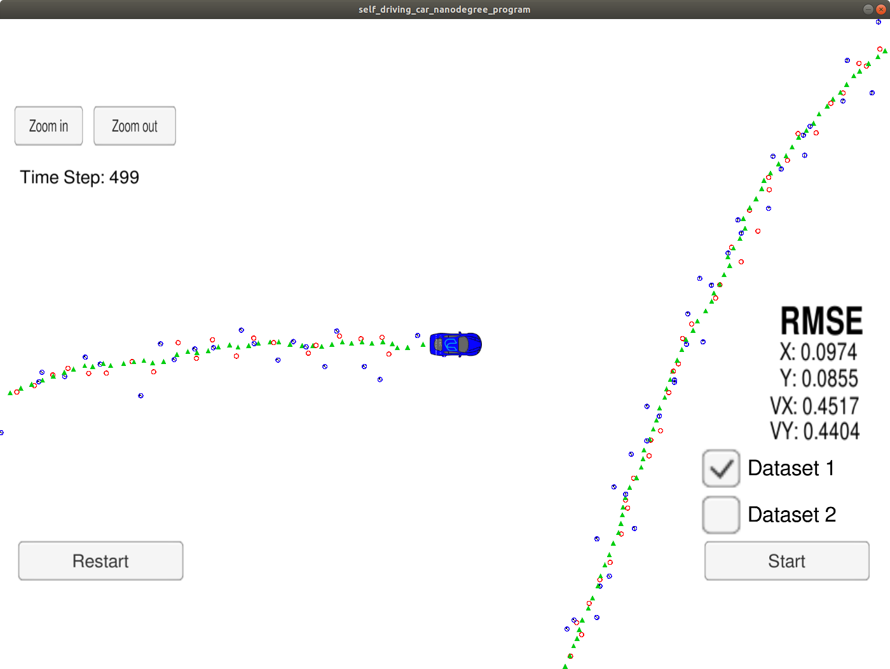

# Extended Kalman Filter Project
In this project I utilize a kalman filter using C++ to estimate the state of a moving object of interest with noisy lidar and radar measurements. Input data consisting of laser measurements (given directly as x and y positions, with some known uncertainty) and radar measurements (given as radius, angle, and radial velocity relative to some fixed measurement site, with some known uncertainty) are combined with a motion model to track a vehicle with much better accuracy than the individual measurements alone allow.

My algorithm is run against Dataset 1 in the simulator "data/obj_pose-laser-radar-synthetic-input.txt" I collect the positions that my algorithm outputs into the folder results and compare them to ground truth data. My px, py, vx, and vy RMSE is less than or equal to the values [.11, .11, 0.52, 0.52]. 

## This meets the project rubric threshold requirements of [.11, .11, .52, .52]

**Red circles are lidar measurements.**

**Blue circles** are radar measurements (position markers inferred from radius and angle; the also-supplied radial velocity measurements are not shown).

**Green markers** are the car's position as estimated by the Kalman filter. It's clear that the Kalman filter does a good job of tracking the car's position with significantly reduced noise.

The results output files are supplied in the results directory.

## The contents of the repository

 - **src a directory with the project code:**

    **main.cpp** - reads in data, calls a function to run the Kalman filter, calls a function to calculate RMSE
    **FusionEKF.cpp** - initializes the filter, calls the predict function, calls the update function
    **kalman_filter.cpp** - defines the predict function, the update function for lidar, and the update function for radar
    **tools.cpp** - a function to calculate RMSE and the Jacobian matrix

